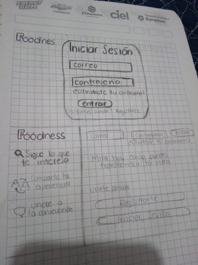
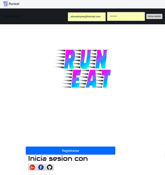
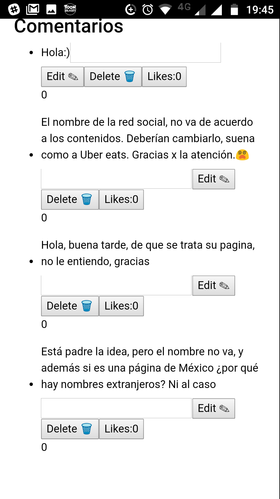
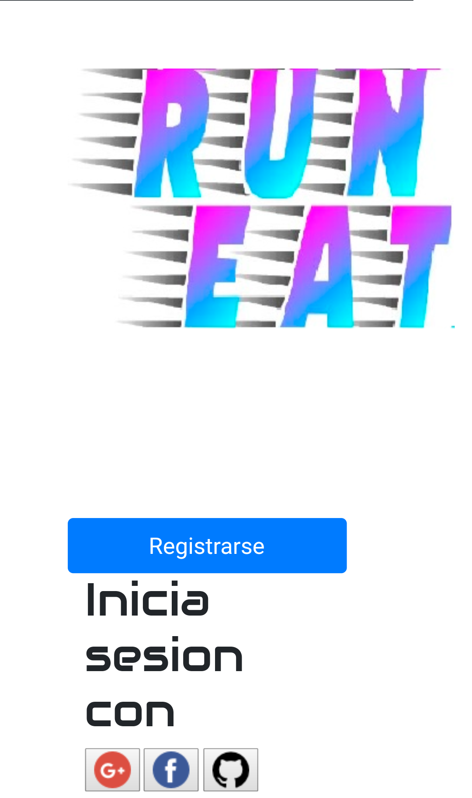

# INTRODUCCIÓN

El exceso de peso corporal (sobrepeso y obesidad) es reconocido actualmente como uno de los retos más importantes de salud pública en el mundo, dada su magnitud, la rapidez de su incremento y el efecto negativo que ejerce sobre la salud de la población que lo padece. El sobrepeso y la obesidad incrementan significativamente el riesgo de padecer enfermedades crónicas.
La inactividad física es considerada como uno de los factores de riesgo de mortalidad más importantes en México y está asociada con la aparición y falta de control de diversas enfermedades crónicas como obesidad, hipertensión, diabetes mellitus, dislipidemias, osteoporosis y ciertos tipos de cánceres. Por ello, promover la actividad física fue reconocido en el Acuerdo Nacional para la Salud Alimentaria (ANSA) como el primer objetivo de una política para la prevención y control del sobrepeso en el ámbito nacional. La Organización Mundial de la Salud (OMS) reporta que la inactividad física en adultos ha tenido un incremento del 14% en los últimos tres años en el ámbito mundial. Los cambios tecnológicos han propiciado que las personas tengan un estilo de vida más sedentario con episodios breves y ocasionales de actividad moderada o vigorosa durante el día.

## RED SOCIAL

En este proyecto vamos a crear una red social que incentive a sus usuarios a realizar actividad física, esta comunidad les ayudara a mantenerse saludables gracias al apoyo de sus otros usuarios, aquí también podrán compartir sus gustos en deportes, tips saludables, etc…
Contaran con el apoyo de una/un psicóloga/o, para ayudarlos cuando se sientan que ya no pueden continuar o simplemente para contarle como se están sintiendo; también se busca incluir un mapa con información de nutriólogos por si nuestros usuarios necesitan apoyo para una dieta o para que los orienten que pueden  comer dependiendo del ejercicio que realicen.

La fiebre por salir a correr se desató como una opción de ejercico económica y apta para todo el público,los beneficios que le da a una persona son bastantes, algunos de ellos son:

* Se logra perder peso y además se puede controlar el mismo, ya que al ser una actividad aerobica permite incrementar el gasto calorico durante todo el día.
* Regenera la masa muscular, con este ejercico no solo se tonifican la piernas, sino también gluteos e incluso abdomen, espalda y brazos debido al balanceo que se realiza para mantener el equilibrio.
* Fortalece los huesos, los expertos recomiendan que se realicen ejercicios de impacto para evitar la osteoporosis y otras dolencias óseas. El running es un buen método, pues mejora e incrementa la densidad de los huesos.
* Combate el estrés y la ansiedad, la práctica de ejercicio en general también tiene beneficios a nivel mental ya que su realización incita la segregación de endorfinas, conocidas coloquialmente como las hormonas de la felicidad. Por ello, el runningtambién es una buena opción para disminuir estados nerviosos.
* Ayuda a descansar, hacer deporte relaja el cuerpo y la mente debido a la segregación de endorfinas. Esto, sumado al cansancio que resulta de la sesión, es el mejor aliado para conciliar un sueño profundo y que asegure el buen descanso.
* Mejora el sistema cardiovascular y respiratorio, la práctica constante del running permite calibrar el ritmo respiratorio y oxigenando así y cada vez mejor el organismo.  
* Evita contraer enfermedades, la rutina de ejercicio, en general, fortalece el cuerpo y ayuda a incrementar los anticuerpos. En el caso del running, practicarlo con regularidad disminuye las probabilidades de sufrir diabetes del tipo II, colesterol, hipertensión y obesidad, problemas comunes entre las personas que mantienen una vida sedentaria.
* Vía de socialización, se puede salir a correr solo, pero también acompañado. De este modo se puede pasar un buen rato en buena compañía. Además, ayuda a intensificar el ejercicio debido al factor reto, pues siempre que se realiza un deporte junto a alguien se tiende a buscar la autosuperación.
* Mejora la autoestima, en conjunto, todos estos factores llevan a una conclusión común: levanta el ánimo. Sentirse bien con uno mismo, relajado y aprobar la propia imagen son los fundamentos para ganar confianza y quererse un poco más.

Se realizo un par de entrevistas con nuestra clienta Sofia, para poderle exponer nuestras propuestas con respecto a esta red social.
Lo primero que sucedio fue que no le gusto mucho nuestra idea ya que englobaba temas como salud y alimentación, por que en un principio se queria hacer una red social enfocada a alimentación saludable y fitness, para todo tipo de gente, lo cual, nos comento Sofía, era un rango muy grande de personas, por lo que tuvimos pensar nuevamente que queriamos hacer con esta red social, haciendo un poco de preguntas e investigando un poco más al respecto, nos dimos cuenta que debiamos pensar en un grupo de personas mas especifico, por lo que pensamos en las personas que gustan de correr, ya sea solo o en grupo.
Por lo que nuestra red social ahora estaba enfocada más en salud que en alimentación.
Volvimos a tener una entrevista con Sofía y aquí ya le replanteamos nuestra idea, que solo iria enfocado a corredores y que en nuestra red social podrían compartir contenido con personas que comparten su gusto por salir a correr. Esta idea le agrado más a Sofía y nos permitio contuniar con el proyecto.

## HISTORIAS DE USUARIOS

* Yo como usuario, busco en esta red social identificarme con personas como yo en busca del control de nuestro peso y así disminuir el riesgo de padecer enfermedades crónicas degenerativas.
* Yo como usuario busco en esta red social un conjunto de personas que den tips de alimentación.
* Yo como usuario busco en esta red social personas que compartan los mismos ideales.
* Yo como usuario busco en esta red social personas que me motiven a llegar a mi meta.
* Yo como usuario busco en esta red social que me recomienden lugares para comer sano.
* Yo como usuario busco en esta red social poder publicar mi progreso para así motivar a otros usuarios.
* Yo como usuario con sobrepeso busco en esta red social poder hacer publicaciones en mi muro.
* Yo como usuario con sobre peso busco en esta red social crear comunidad con otros usuarios para salir juntos a hacer actividades físicas.
* Yo como usuario busco que se me recompense por mi esfuerzo al querer cambiar mi físico.

## SKETCHING

La planeación del proyecto se inicio con un sketching, basado en mobile first de como se queria visualizar el "Login" y el muro.

## PROTOTIPO
Basandonos en la encuesta de color y tipografía se realizo un prototipo de Login con los colores que los usuarios nos referian como los que más les gustaron y el tipo de letra que les gustaría ver en la pagina.

## ENCUESTAS

* Se realizo una encuest para saber que gamma de colores  y que tipogragía sería la adecuada para nuestros usuarios, esto se realizo mediante una encuesta de Google. Los resultados fueron los siguinetes:

## TESTING CON USUARIOS

Se realizo una prueba del producto con 3 usuarios:

* Carmen Lara
* Rafael Bermúdez
* Claudia Elena Pérez

Cada uno probo la pagina de nuestra red social en diferentes dispositivos, por lo que pudimos observar es que a ninguno de los 3 les gusto el diseño del muro, ya que decían que era poco entendible y en el caso de el celular y tablet, no se lograba apreciar muy bien ya que debian hacer zoom para poder poner un comentario, nos dijeron que no les servia de mucho una gráfica de alimentación ya que no creian que era apropiada para una red social de corredores, que les gustaria ver algo mas relacionado a eso, como lugares para ir a correr, por ejemplo.
Tampoco les gusto mucho el nombre de la red social, que en este caso era "Run Eat", por lo que se decidio cambiarlo a "Run4Fun", este último les agradó más por que ven el correr como diversión y pasarla bien entre ellos.

Realizaron algunos comentarios en el muro que acontinuación se mostraran:

Imagen del Login:

Por lo que se decidio cambiar un poco el nombre de la red social:

## MODO DE INGRESO A LA RED SOCIAL

Para poder a ingresar a esta red social, existen dos opciones; la primera, es necesario que te registres con correo electronico y una contraseña, y la segunda es que inicies sesión con alguna de tus redes sociales: "Facebook, Google, y GitHub", "Twitter" no se pudo poner aun en el proyecto por que las politas de Twitter cambiaron y ahora debes pedir un permiso para poder tenre acceso con dicha red social. Una vez que hiciste alguna de estas opciones, se te redireccionara al muro para que puedas empezar a compartir tus experiencias en el mundo del running. (Para el ingreso con correo y contraseña se te enviara un correo al email proporcionado para activar tu cuenta).